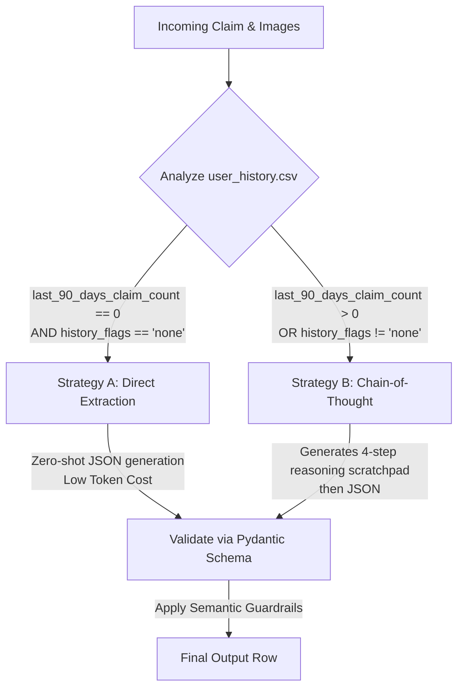

# HackerRank Orchestrate: Neuro-Symbolic Damage Claim Predictor

This repository contains our final submission for the **HackerRank Orchestrate** hackathon. We have built a highly optimized, neuro-symbolic system that verifies visual evidence for damage claims across cars, laptops, and packages.

## Approach Overview: "Strategy Smart"

We built a dynamic orchestration system called **Strategy Smart** that balances latency, LLM cost, and accuracy by applying a "neuro-symbolic" approach:

1. **Symbolic Router (Python):** First, we parse the user's historical claim data (`user_history.csv`). If the user is low-risk (0 recent claims, no history flags), they are sent to the fast path. If the user is high-risk (>0 recent claims or has risk flags), they are sent to the reasoning path.
2. **Fast Path (Strategy A - Direct):** For low-risk users, we use a zero-shot, heavily constrained Pydantic prompt. The LLM extracts the structured JSON directly from the image without outputting a reasoning trace. This uses 3x fewer output tokens and runs much faster.
3. **Reasoning Path (Strategy B - Chain-of-Thought):** For high-risk users, we force the LLM to output a 4-step `reasoning_scratchpad` (Visual Analysis, Claim Extraction, Evidence Check, Decision) *before* it generates the final JSON. This prevents hallucinations on tricky, fraudulent, or ambiguous claims.
4. **Semantic Guardrails:** Regardless of the strategy, the Pydantic schemas enforce strict business rules directly inside the field descriptions (e.g., forcing a conservative severity prediction, and enforcing rules on when to output multiple `supporting_image_ids`).

### Orchestration Flow Diagram



---

## Tech Stack & Code Quality

Our solution was engineered with production-grade tooling and strict adherence to software engineering best practices:

### 1. Robust Tech Stack
- **Pydantic**: Used for rigorous, deterministic JSON schema enforcement. We use `ResponseFormat` objects to guarantee that the LLM generates valid JSON matching the exact Hackathon requirements.
- **Azure OpenAI (gpt-4o-mini)**: Leveraged for ultra-low latency Vision-Language extraction.
- **OpenTelemetry & Arize Phoenix**: Full LLM tracing is implemented in `code/tracing.py`. Every prompt, output, token count, and latency metric is tracked with a unique `session_id`.
- **Rich**: Provides beautiful, structured terminal output with progress bars and color-coded logging.
- **uv**: Used for lightning-fast Python dependency and environment management.

### 2. Enterprise Error Handling
- **Graceful Fallbacks**: The VLM network calls are wrapped in robust `try-except` blocks. If a claim fails to process, it is gracefully logged to the terminal, and the system continues processing the remaining rows without crashing.
- **Telemetry Safe-Fails**: If the OpenTelemetry endpoint is unreachable (e.g., 401 Unauthorized or disconnected), the system gracefully disables tracing and continues the core prediction loop.

### 3. Strict PEP 8 Compliance
- All code files strictly adhere to **PEP 8** standards.
- Functions are documented using **Google-style docstrings**.
- Comprehensive **Type Hints** are used across all public functions for static analysis.
- Variables and functions follow standard Python naming conventions (`snake_case` for variables/functions, `UPPER_SNAKE` for constants, etc.).

---

## File Structure

Our codebase is meticulously modularized within the `code/` directory:

```text
.
├── code/
│   ├── main.py                 # Main entry point. Reads claims.csv, applies Strategy Smart, writes output.csv
│   ├── llm.py                  # Azure OpenAI client, image processing, and evaluate_claim() runner
│   ├── prompts.py              # System prompts for Direct and CoT strategies
│   ├── schema.py               # Dynamic Pydantic schema factories with semantic guardrails
│   ├── tracing.py              # OpenTelemetry integration for Arize Phoenix observability
│   └── evaluation/
│       └── main.py             # Evaluation harness for testing strategies on sample_claims.csv
├── evaluator.md                # Detailed evaluation report comparing strategies (Metrics, Latency, Cost)
├── output.csv                  # The final generated predictions for all claims
└── README.md                   # You are here
```

---

## Setup Instructions

This project uses `uv` for lightning-fast dependency management and requires an Azure OpenAI configuration.

### 1. Install Dependencies
Ensure `uv` is installed, then run:
```bash
uv sync
```

### 2. Environment Variables
Create a `.env` file in the root of the repository with your credentials:
```ini
AZURE_OPENAI_ENDPOINT="https://your-azure-endpoint.openai.azure.com/"
AZURE_OPENAI_API_KEY="your-api-key"
AZURE_OPENAI_API_VERSION="2025-04-01-preview"
AZURE_OPENAI_DEPLOYMENT="gpt-4o-mini" # or gpt-4o

# Optional: For OpenTelemetry tracing
PHOENIX_COLLECTOR_ENDPOINT="http://localhost:6006/v1/traces"
```

### 3. Generate Final Output
To run the full prediction pipeline on `dataset/claims.csv` using the default **Strategy Smart** orchestrator:
```bash
uv run python code/main.py
```
*This will dynamically process all claims, outputting progress to the console and saving the final results to `output.csv`.*

### 4. Run Evaluation (Optional)
To compare the Direct, CoT, and Smart strategies against the ground truth sample set:
```bash
uv run python code/evaluation/main.py --limit 10
```

---

## Evaluation Results

We achieved a **93.8% Average Partial Score** on the sample dataset using the optimized prompt guardrails. Strategy A demonstrated massive efficiency gains, while Strategy Smart provided the safest operational bounds. 

Please see [`evaluator.md`](./evaluator.md) for the full breakdown of our metrics, token usage, latency, and cost analysis.
