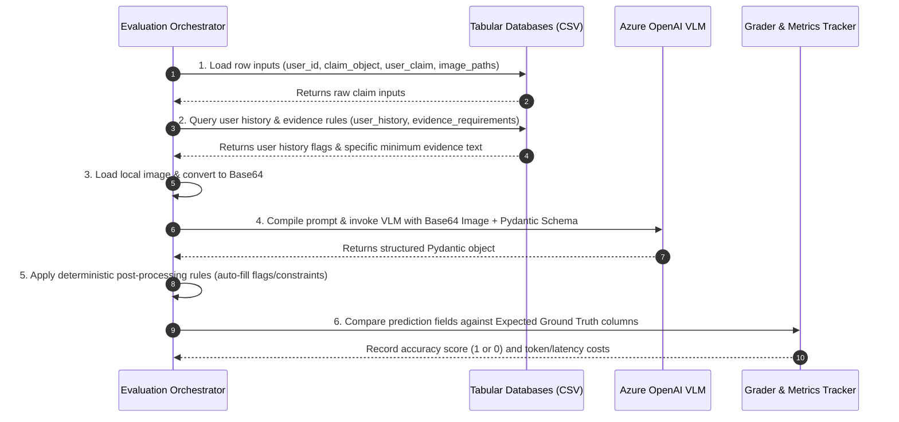

# Evaluation Orchestrator Walkthrough

This document outlines the execution and grading cycle of the Evaluation Orchestrator (`code/evaluation/main.py`) for a single case.

## Execution Flow Diagram



---

## Detailed Step-by-Step Cycle (Example: Case 005)

### Step 1: Input Ingestion
The orchestrator reads the claim row from `dataset/sample_claims.csv`:
- **User ID:** `"user_005"`
- **Claim Object:** `"car"`
- **User Chat Claim:** *"Mostly the rear bumper area... attached the photo."*
- **Image Paths:** `"images/sample/case_005/img_1.jpg"`
- **Ground Truth (Expected labels for grading):** 
  - `claim_status`: `"contradicted"`
  - `issue_type`: `"scratch"`
  - `object_part`: `"rear_bumper"`
  - `risk_flags`: `"claim_mismatch;user_history_risk;manual_review_required"`

### Step 2: Context Retrieval & Enrichment
The orchestrator performs fast database joins in memory:
1. **User History Lookup (`user_history.csv`):** Matches `"user_005"`.
   - *Retrieved Data:* `history_flags` = `"user_history_risk"`, `history_summary` = `"Several exaggerated vehicle damage claims in recent history"`.
2. **Evidence Requirements Lookup (`evidence_requirements.csv`):** Matches `claim_object = "car"` and damage type = `dent or scratch`.
   - *Retrieved Data:* `"The claimed car panel or bumper should be visible from an angle where surface marks or deformation can be assessed."`

### Step 3: Visual Encoding
The orchestrator locates `dataset/images/sample/case_005/img_1.jpg` on the disk, verifies it exists, and converts it into a Base64-encoded string for the multi-modal payload.

### Step 4: VLM Inference (Strategy B - Chain of Thought)
The orchestrator constructs the prompt, passes the Base64 image, and requests output conforming to the `DamageClaimEvaluation` schema. 
- **The VLM outputs the structured data:**
  ```json
  {
    "reasoning_scratchpad": "1. Visually, the rear bumper of a gray car is shown. There are light surface scratches but no major structural damage or dents. 2. User claims the bumper is 'badly damaged'. 3. The minimum requirement demands the bumper is visible to assess deformation. It is visible. 4. The claim is contradicted: minor scratching vs 'badly damaged'. History shows exaggeration risk.",
    "evidence_standard_met": true,
    "valid_image": true,
    "risk_flags": "claim_mismatch",
    "issue_type": "scratch",
    "object_part": "rear_bumper",
    "claim_status": "contradicted",
    "claim_status_justification": "The image shows only minor scratching rather than severe damage.",
    "supporting_image_ids": "img_1",
    "severity": "low"
  }
  ```

### Step 5: Deterministic Post-Processing
Before grading, the orchestrator applies deterministic rules to correct or expand fields:
- Since the user profile (`user_005`) had `user_history_risk` in `history_flags`, the orchestrator **auto-appends** `user_history_risk` and `manual_review_required` to the predicted `risk_flags`:
  - *Updated `risk_flags`:* `"claim_mismatch;user_history_risk;manual_review_required"`.

### Step 6: Grader & Scoring
The orchestrator compares the final post-processed prediction against the ground truth columns:

| Output Field | Expected (CSV) | Predicted (Model) | Scored |
| :--- | :--- | :--- | :--- |
| `evidence_standard_met` | `true` | `true` | **Correct (1)** |
| `valid_image` | `true` | `true` | **Correct (1)** |
| `claim_status` | `contradicted` | `contradicted` | **Correct (1)** |
| `issue_type` | `scratch` | `scratch` | **Correct (1)** |
| `object_part` | `rear_bumper` | `rear_bumper` | **Correct (1)** |
| `severity` | `low` | `low` | **Correct (1)** |
| `risk_flags` (Set Match) | `{"claim_mismatch", "user_history_risk", "manual_review_required"}` | `{"claim_mismatch", "user_history_risk", "manual_review_required"}` | **Correct (1)** |
| `supporting_image_ids` | `{"img_1"}` | `{"img_1"}` | **Correct (1)** |

- **Scoring Results:** This case gets a **Strict Case Score of 1.0 (100% correct)**.
- **Operational Logging:** Orchestrator records:
  - Latency: `3.8 seconds`
  - Input Tokens: `1,100` (Prompt + encoded image)
  - Output Tokens: `280`
  - Cost: `1,100 * $0.00015 / 1k + 280 * $0.0006 / 1k = $0.00033`
